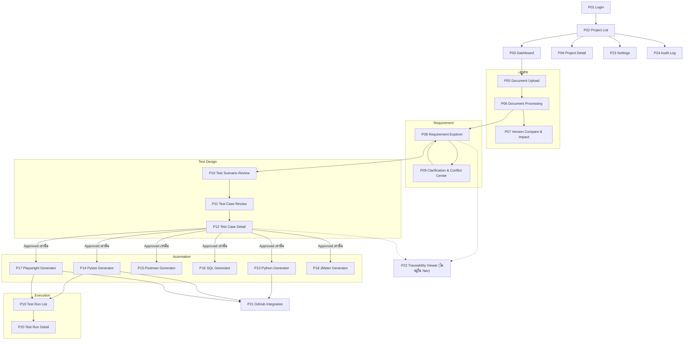

# Page Specification (แทนหัวข้อ 27 ใน Master Prompt)

> คำตอบที่ 1 ของการสนทนา — ตอบคำขอ "แบ่ง Page ชัดเจน"

## 27.1 หลักการแบ่งหน้า

ระบบแบ่งหน้าเป็น 3 ระดับ:

1. **Public**: หน้าที่เข้าได้โดยไม่ต้อง Login (มีเพียง Login)
2. **Global**: หน้าที่ไม่ผูกกับ Project (Project List, Settings, Audit Log)
3. **Project-scoped**: ทุกหน้าอยู่ใต้ `/projects/[projectId]/...` เพื่อให้ Project Selector, Breadcrumb และ Permission ทำงานสอดคล้องกัน

ทุกหน้าที่ไม่ใช่ Public ใช้ App Shell เดียวกัน ประกอบด้วย Sidebar, Top Bar (Project Selector, Language Switch TH/EN, User Menu, Session Timer), Breadcrumb และ Content Area

## 27.2 Sitemap

## 27.3 Sidebar Navigation

| กลุ่ม | เมนู | Route |
|---|---|---|
| ภาพรวม | Dashboard | `/projects/[pid]/dashboard` |
| | Project Detail | `/projects/[pid]` |
| เอกสาร | Upload | `/projects/[pid]/documents/upload` |
| | Processing | `/projects/[pid]/documents/[docId]/processing` |
| | Version Compare | `/projects/[pid]/documents/compare` |
| Requirement | Requirement Explorer | `/projects/[pid]/requirements` |
| | Clarification & Conflict | `/projects/[pid]/clarifications` |
| Test Design | Test Scenarios | `/projects/[pid]/test-scenarios` |
| | Test Cases | `/projects/[pid]/test-cases` |
| Automation | Python | `/projects/[pid]/automation/python` |
| | Pytest | `/projects/[pid]/automation/pytest` |
| | Postman | `/projects/[pid]/automation/postman` |
| | SQL (MySQL) | `/projects/[pid]/automation/sql` |
| | Playwright | `/projects/[pid]/automation/playwright` |
| | JMeter | `/projects/[pid]/automation/jmeter` |
| Execution | Test Runs | `/projects/[pid]/test-runs` |
| Integration | GitHub | `/projects/[pid]/github` |
| ระบบ (Admin) | Settings | `/settings` |
| | Audit Log | `/audit-log` |

หน้าที่ไม่แสดงใน Sidebar: Login (`/login`), Project List (`/projects`), Test Case Detail (`/projects/[pid]/test-cases/[tcId]`), Test Run Detail (`/projects/[pid]/test-runs/[runId]`), Traceability Viewer (`/projects/[pid]/traceability`)

เมนูที่ Role ไม่มีสิทธิ์ต้องซ่อนจาก Sidebar และ Backend ต้องตรวจสิทธิ์ซ้ำเสมอ

> หมายเหตุ: เว็บไซต์ที่สร้างจริง (ไฟล์ HTML เดียว) ใช้ Hash Route รูปแบบ `#/p/[pid]/...` แทน `/projects/[pid]/...`

## 27.4 Role Access Matrix

E = แก้ไข/ดำเนินการได้, V = ดูได้, C = Comment/ตอบคำถามได้, — = เข้าไม่ได้

| หน้า | Admin | QA Manual | QA Automation | BA |
|---|---|---|---|---|
| P02 Project List | E | V | V | V |
| P03 Dashboard | V | V | V | V |
| P04 Project Detail | E | V | V | V |
| P05 Upload | E | E | — | — |
| P06 Processing | E | E | V | V |
| P07 Version Compare | E | E (Approve Impact) | V | V |
| P08 Requirement Explorer | E | E | V | V + C |
| P09 Clarification & Conflict | E | E | V | C (ตอบ/Resolve) |
| P10 Test Scenario Review | E | E | V | V + C |
| P11–P12 Test Case | E | E (Approve) | V | V + C |
| P13 Python | E | V (Code + Tips) | E | V (Tips) |
| P14 Pytest | E | V (Code + Tips) | E | — |
| P15–P18 Postman/SQL/Playwright/JMeter | E | V | E | — |
| P19–P20 Test Runs | E | V | E | V |
| P21 GitHub | E | — | E (Propose) | — |
| P22 Traceability | V | V | V | V |
| P23 Settings | E | — | — | — |
| P24 Audit Log | V | — | — | — |

## 27.5 รายละเอียดแต่ละหน้า

### P01 Login — `/login`
- จุดประสงค์: เข้าสู่ระบบด้วย Local Account
- องค์ประกอบ: Username, Password, ปุ่ม Login, ข้อความ Error แบบไม่เปิดเผยว่า Username หรือ Password ผิด
- กฎ: Rate limit การ Login, บังคับเปลี่ยน Password เมื่อ Login ครั้งแรกด้วย Seed Admin, Redirect ไปหน้าเดิมหลัง Session หมดอายุ
- API: `POST /api/auth/login`, `GET /api/auth/me`

### P02 Project List — `/projects`
- จุดประสงค์: เลือกหรือสร้าง Project
- องค์ประกอบ: ตาราง Project (Code, Name, BRS Version ล่าสุด, จำนวน Requirement/Test Case, Updated), ปุ่ม Create Project
- กฎ: Project Code ตัวพิมพ์ใหญ่ ใช้เป็นส่วนหนึ่งของ ID ทุกชนิด แก้ไม่ได้หลังมี Requirement
- API: `GET/POST /api/projects`

### P03 Dashboard — `/projects/[pid]/dashboard`
- KPI Cards: Requirement, Needs Clarification (ส้ม), Conflict (แดง), Test Scenario, Test Case, Approved, Ready for Automation, Automation Coverage
- Charts: Test Case ตาม Status, Pass/Fail/Blocked ของ Run ล่าสุด
- Tables: Test Run ล่าสุด, Document Processing Job, BRS Version ล่าสุด
- ทุก Card คลิกแล้วไปหน้าที่ Filter ไว้แล้ว
- Empty state เมื่อยังไม่มีเอกสาร พร้อมปุ่มไป Upload

### P04 Project Detail — `/projects/[pid]`
- แท็บ: Documents & Versions, Members, Module Codes
- API: `GET/PATCH /api/projects/{id}`

### P05 Document Upload — `/projects/[pid]/documents/upload`
- แท็บ Upload File (Drag & drop หลายไฟล์) และแท็บ Paste Text
- ตัวเลือก: เอกสารใหม่หรือ Version ใหม่, Module Code เริ่มต้น, วิธีวิเคราะห์ (Claude AI / Rule Engine), เปิด/ปิด Vision
- ตรวจชนิดไฟล์จาก Content, แสดง Error ต่อไฟล์โดยไม่ยกเลิกไฟล์อื่น
- API: `POST /api/projects/{id}/documents`, `POST /api/projects/{id}/paste-text`, `POST /api/documents/{id}/process`

### P06 Document Processing — `/projects/[pid]/documents/[docId]/processing`
- Stepper: Uploaded → Extracting → Normalizing → Creating Sections → Analyzing Requirements → Detecting Conflicts → Generating Questions → Ready for Review / Failed
- ตาราง Section พร้อม Filter "Failed only"
- Actions: Retry Section, Retry Failed Only, Cancel Job, Resume Job, ดู Error, Download Processing Log
- รูปภาพที่ Extract ได้ สถานะ Needs Visual Review
- API: `GET /api/documents/{id}/progress`, `POST /api/documents/{id}/retry-failed`

### P07 Version Compare & Impact — `/projects/[pid]/documents/compare?from=&to=`
- เลือก Version A และ B
- แท็บ Section Diff (Added / Removed / Changed แบบ Side-by-side)
- แท็บ Impact: Requirement, Scenario, Test Case, Automation Artifact พร้อม Proposal (No Impact, Review Required, Update Required, New Test Required, Deprecation Candidate) และรายการแนะนำ Retest
- QA Approve/Reject รายรายการหรือทั้งชุด; ไม่แก้ Test Case ที่ Approved อัตโนมัติ

### P08 Requirement Explorer — `/projects/[pid]/requirements`
- Toolbar: Search, Filter (Type, Status, Module, Score, Conflict, Needs Clarification), Compare
- Split View: ซ้าย Source / กลาง Requirement / ขวา AI Analysis (Score พร้อมเหตุผล, Found in BRS, Assumptions, Recommendations, Questions, Conflicts)
- Actions: Edit (สร้าง Version ใหม่), Review, Approve, Traceability, สร้าง Test Scenario

### P09 Clarification & Conflict Center — `/projects/[pid]/clarifications`
- แท็บ Questions: BA ตอบ + Resolve Clarification
- แท็บ Assumptions: ป้าย `AI ASSUMPTION - NOT FOUND IN BRS` QA แก้ไข/ยอมรับ/ปฏิเสธ
- แท็บ Conflicts: เปรียบเทียบ 2 ฝั่ง, Highlight, Resolve พร้อมเหตุผลบังคับ, ประวัติ
- ห้ามเลือกฝั่งล่าสุดอัตโนมัติ

### P10 Test Scenario Review — `/projects/[pid]/test-scenarios`
- Generate จาก Requirement ที่ Approved, ตาราง Scenario, AI Rationale, คำเตือน Duplicate

### P11 Test Case Review — `/projects/[pid]/test-cases`
- แก้ไขในตาราง, Search, Filter, Sort, Bulk Approve, Export Excel, ไอคอน Lock

### P12 Test Case Detail — `/projects/[pid]/test-cases/[tcId]`
- Business Explanation, Given/When/Then, Test Steps, Priority/Risk พร้อมเหตุผล, ที่มาของ Test
- แท็บ Version History, Comments & Approvals
- Approved → ปุ่ม Create New Version

### P13 Python Generator — `/projects/[pid]/automation/python`
- ซ้าย: เลือก Test Case (Approved เท่านั้น, Toggle Generate Draft Code)
- กลาง: File Tree + Code Editor
- ขวา: Code Tips ภาษาไทย (จุดประสงค์, Input, Output, เหตุผล, อธิบาย, Test Case, ข้อควรระวัง, สิ่งที่ต้องแก้ก่อน Run)
- Actions: Generate, Copy, Download File, Download ZIP, Edit Draft, Reset, Diff, Run, Log

### P14 Pytest Generator — `/projects/[pid]/automation/pytest`
- เหมือน P13 + conftest.py, pytest.ini, requirements.txt, Fixtures, Factory + Run Panel

### P15 Postman Generator
- Collection Preview, Auth Config (ค่าเริ่มต้น NEEDS_CONFIGURATION), Environment Template, Import Newman Result

### P16 SQL Generator
- ประเภท Query 9 แบบ, MySQL, Placeholder, Table/Column เป็น Assumption, Read-only

### P17 Playwright Generator
- From Test Case, Record Flow, AI Exploration (Manual Checkpoint สำหรับ Login/OTP/CAPTCHA), Page Objects, Suggest New Locator
- ไม่มีฟังก์ชันใดอ่านหรือแก้ CAPTCHA

### P18 JMeter Generator
- Load/Stress/Spike, Users/Ramp/Duration ภายใต้ Limit, Allowlist, Block Production, Warning สีแดง, Download JMX/CSV

### P19 Test Run List / P20 Test Run Detail
- Summary, Results (เชื่อม TC ID), Logs (stdout/stderr, Masking), Evidence, Cancel, Re-run

### P21 GitHub Integration
- Connection (Token ที่ Backend เท่านั้น), Proposals พร้อม Preview (Repo, Branch, Files, Diff, Commit Message, Action Type), Approve → Execute, Workflows (`workflow_dispatch`)
- ไม่มี Merge หรือ Force Push, Block ไฟล์ต้องห้าม

### P22 Traceability Viewer — `/projects/[pid]/traceability`
- Document → Version → Section → Requirement → Scenario → Test Case → Artifacts → Run → Result
- เปิดจาก P08 และ P12 เท่านั้น

### P23 Settings (Admin)
- Users & Roles, AI Provider, Test Runner Limits, GitHub, Environments & Allowlist, Network Sharing (พร้อมคำเตือน), Session Timeout

### P24 Audit Log (Admin)
- ตาราง Event, Filter, Export CSV, ไม่แสดง Password/Token/OTP/Session Cookie

## 27.6 มาตรฐานที่ทุกหน้าต้องมี

Loading state, Empty state พร้อม Action ถัดไป, Error state (Error Code, User Message, Correlation ID, Retry), Confirmation Dialog สำหรับ Approve/Cancel/Execute/Delete, Status Badge ตาม Color Convention และ Breadcrumb ที่สะท้อน Route
