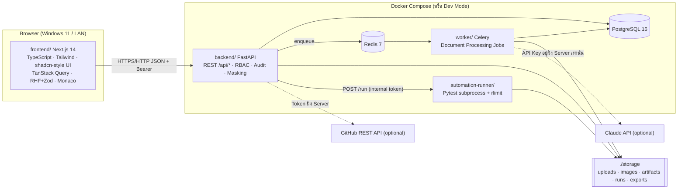
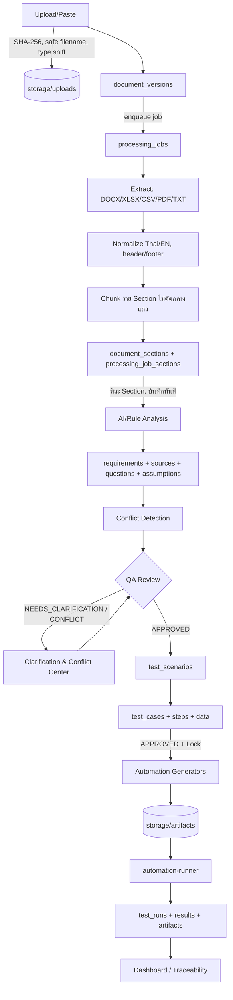
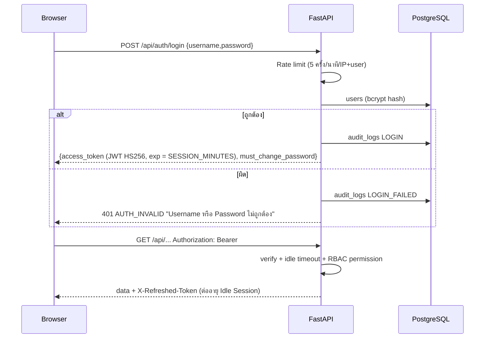
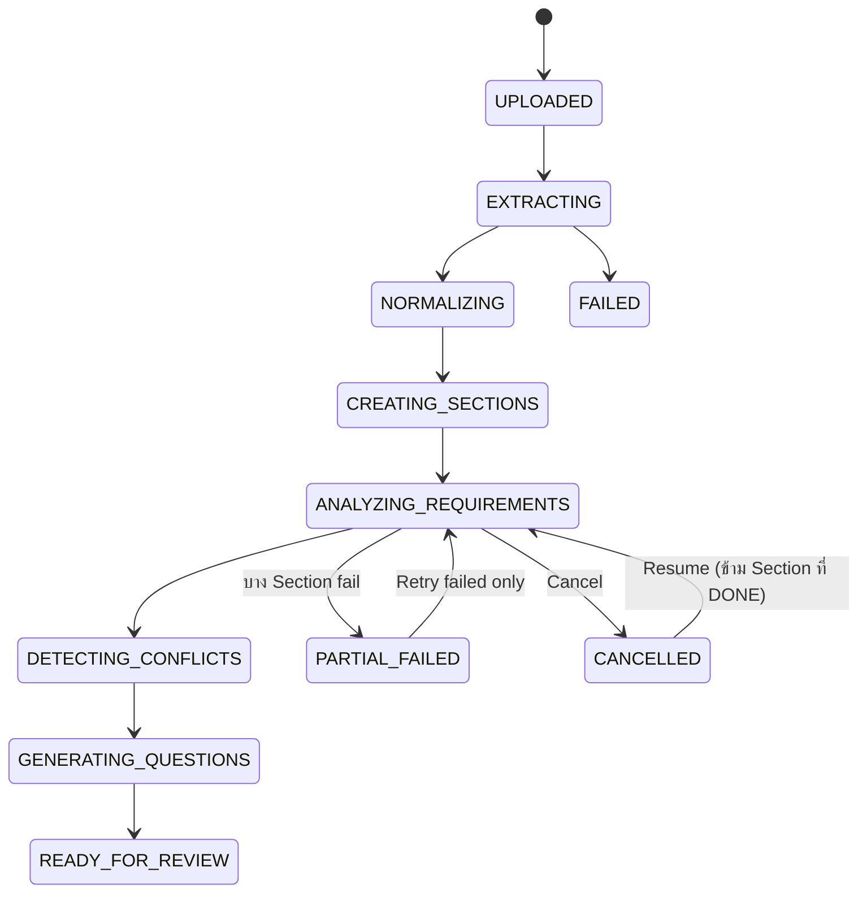

# ARCHITECTURE — BRS to QA Automation Platform

## 1. Component View



- Frontend ไม่เคยได้รับ Secret (Claude Key, GitHub Token, Runner Token)
- Backend เป็นจุดเดียวที่ตรวจสิทธิ์ (RBAC) — Frontend ซ่อนเมนูเพื่อ UX เท่านั้น
- Worker ใช้ Code เดียวกับ Backend (`backend/app`) ผ่าน `PYTHONPATH` จึงไม่มี Logic ซ้ำ

## 2. Backend Layering

```
backend/app/
  main.py            FastAPI app, middleware (CORS, CSP headers, rate limit, correlation id)
  config.py          Settings จาก Environment (.env)
  db.py              Engine/Session
  models/            SQLAlchemy models (38 tables)
  schemas/           Pydantic DTO
  api/               Routers (auth, projects, documents, requirements, scenarios, testcases,
                     automation, runs, github, traceability, settings, audit, dashboard)
  services/
    engine/          Port จาก p3_engine.js: parsers, normalize, sections, extraction, quality,
                     questions, conflicts
    testdesign.py    Port จาก p4_gen.js ส่วน Test Design: boundary, priority/risk, scenario, test case
    generators/      Port จาก p4_gen.js ส่วน Automation: python, pytest, postman, sql, playwright,
                     jmeter, github_actions, secret_scan, diff
    excel_export.py  10 Sheet (openpyxl) + Freeze Header + สีตาม Status
    processing.py    Pipeline ราย Section (Retry/Resume/Cancel)
    compare.py       Version Compare + Impact Proposal
    ai_provider.py   AIProvider Interface: RuleBasedProvider, ClaudeProvider
    storage.py       StorageBackend Interface: LocalStorage (MinIO/Azure ในอนาคต)
    runner_client.py เรียก automation-runner
    github_service.py Proposal → Approve → Execute (ไม่มี Merge/Force Push)
  repositories/      Query helpers (Repository Pattern)
  core/              security (bcrypt, token), rbac, masking, errors, audit, ratelimit
```

## 3. Data Flow



## 4. Authentication Flow



- `must_change_password=true` → Frontend บังคับไปหน้าเปลี่ยนรหัสผ่าน และ Backend ปฏิเสธ API อื่น (`PASSWORD_CHANGE_REQUIRED`)
- รองรับ SSO/Entra ID ในอนาคตผ่าน `AuthProvider` (ตอนนี้ `LocalAuthProvider`)

## 5. Document Processing Flow



- แต่ละ Section มีสถานะ `PENDING/RUNNING/DONE/FAILED/SKIPPED` และ attempts, error
- Retry ทำเฉพาะ Section ที่ FAILED; Resume ทำเฉพาะ PENDING/FAILED
- Cancel ตั้ง flag `cancel_requested` ที่ Job; Worker ตรวจก่อนทุก Section

## 6. Automation Flow

```mermaid
flowchart LR
  TC[Test Case APPROVED] -->|lock| G[Generate Python/Pytest/...]
  D[Draft toggle] -.->|ติดป้าย DRAFT| G
  G --> SS[Secret Scan + Traceability check]
  SS --> AR[automation_artifacts + files ใน storage]
  AR --> E[Edit Draft / Reset AI Version / Diff]
  AR -->|POST /api/automation/{id}/run| RC[runner_client]
  RC --> RN[automation-runner: copy → workspace ชั่วคราว → pytest subprocess<br/>rlimit CPU/RAM, timeout, output cap, env ล้าง]
  RN --> JX[junit.xml → parser]
  JX --> TR[test_runs/results/artifacts]
  AR -->|Propose| GP[github_action_requests]
  GP -->|Approve| GE[Execute: create branch + commit + PR (ไม่มี merge)]
```

## 7. Deployment

- Docker Compose: `postgres`, `redis`, `backend`, `worker`, `runner`, `frontend`
- Volume: `./storage:/data/storage`, `pgdata` (named volume) → ข้อมูลไม่หายหลัง Restart (AC 40)
- Host Binding: `BIND_HOST=127.0.0.1` (ค่าเริ่มต้น); ต้องตั้ง `0.0.0.0` + `ALLOW_NETWORK_SHARING=true` เพื่อเปิด LAN
- Dev Mode (ไม่ใช้ Docker): SQLite + `TASK_MODE=inline` + runner แบบ local subprocess — ดู DEVELOPMENT.md
