# DATABASE

- Application DB: **PostgreSQL 16** (Docker service `postgres`, volume `pgdata`)
- Dev/Test: SQLite (`DATABASE_URL=sqlite:///./storage/dev.sqlite3`)
- ORM: SQLAlchemy 2 (`backend/app/models/__init__.py`)
- Migration: Alembic (`backend/alembic/versions/0001_initial_initial_schema.py`)
- จำนวนตาราง: 41 (38 ตามหัวข้อ 34 + `id_sequences`, `impact_analyses`)

## คำสั่ง

```powershell
cd backend
alembic upgrade head          # สร้าง/อัปเดต Schema
alembic downgrade -1          # ย้อน 1 Revision
alembic revision --autogenerate -m "describe change"
python -m app.seed            # Seed Admin + Example Project + Synthetic Demo Data
```

## หลักการออกแบบ

- PK เป็น UUID (String 36); Business ID (`REQ-`, `TS-`, `TC-`) เป็น Unique Column แยก
- Running Number อยู่ในตาราง `id_sequences` (key = `REQ-CAM-RULE3` ฯลฯ) → ID ไม่ซ้ำแม้ลบข้อมูล
- ค่าที่ไม่พบใน BRS เก็บเป็น `NOT_FOUND` ตามหัวข้อ 32
- Version History: `requirement_versions`, `test_scenario_versions`, `test_case_versions` เก็บ Snapshot + `changes` (field, old, new) + เหตุผล + AI/Human
- Test Case ที่ APPROVED → `locked=true`; แก้ไขต้องสร้าง Version ใหม่ (Version เดิมอยู่ใน `test_case_versions`)
- ไฟล์จริง (BRS, รูปภาพ, Code, Report) อยู่ใน `./storage`; DB เก็บเฉพาะ `storage_path` (Relative ต่อ STORAGE_ROOT)
- ห้ามเก็บ Password/Token แบบ Plain Text — `users.password_hash` เป็น bcrypt; Secret อยู่ใน Environment เท่านั้น

## ตาราง

| Table | Columns |
|---|---|
| `application_settings` | 4 |
| `approvals` | 8 |
| `audit_logs` | 8 |
| `id_sequences` | 2 |
| `projects` | 8 |
| `roles` | 3 |
| `users` | 8 |
| `automation_artifacts` | 17 |
| `comments` | 7 |
| `documents` | 7 |
| `github_integrations` | 7 |
| `project_members` | 3 |
| `user_roles` | 2 |
| `document_versions` | 15 |
| `github_action_requests` | 18 |
| `impact_analyses` | 11 |
| `jmeter_artifacts` | 5 |
| `playwright_artifacts` | 6 |
| `postman_artifacts` | 4 |
| `pytest_artifacts` | 4 |
| `python_artifacts` | 3 |
| `sql_artifacts` | 5 |
| `test_runs` | 15 |
| `document_images` | 9 |
| `document_sections` | 14 |
| `processing_jobs` | 11 |
| `requirements` | 47 |
| `test_run_artifacts` | 6 |
| `test_run_results` | 8 |
| `processing_job_sections` | 8 |
| `requirement_conflicts` | 13 |
| `requirement_questions` | 11 |
| `requirement_sources` | 9 |
| `requirement_versions` | 9 |
| `test_scenarios` | 19 |
| `requirement_assumptions` | 8 |
| `test_cases` | 34 |
| `test_scenario_versions` | 7 |
| `test_case_versions` | 9 |
| `test_data` | 9 |
| `test_steps` | 8 |

## ER Diagram (สร้างจาก Metadata — แสดงเฉพาะ Key Columns)

```mermaid
erDiagram
  application_settings {
    string key PK
  }
  approvals {
    string id PK
    integer version
    string username
  }
  audit_logs {
    string id PK
    string username
  }
  id_sequences {
    string key PK
  }
  projects {
    string id PK
    string code
    string name
  }
  roles {
    string id PK
    string code
    string name
  }
  users {
    string id PK
    string username
    string name
  }
  automation_artifacts {
    string id PK
    string project_id FK
    string kind
    string name
    string status
  }
  comments {
    string id PK
    string project_id FK
    string username
  }
  documents {
    string id PK
    string project_id FK
    string name
  }
  github_integrations {
    string id PK
    string project_id FK
    string status
  }
  project_members {
    string project_id PK
    string user_id PK
  }
  user_roles {
    string user_id PK
    string role_id PK
  }
  document_versions {
    string id PK
    string document_id FK
    integer version
    string status
  }
  github_action_requests {
    string id PK
    string project_id FK
    string artifact_id FK
    string status
  }
  impact_analyses {
    string id PK
    string project_id FK
    string document_id FK
    string status
  }
  jmeter_artifacts {
    string id PK
    string artifact_id FK
  }
  playwright_artifacts {
    string id PK
    string artifact_id FK
  }
  postman_artifacts {
    string id PK
    string artifact_id FK
    string status
  }
  pytest_artifacts {
    string id PK
    string artifact_id FK
  }
  python_artifacts {
    string id PK
    string artifact_id FK
  }
  sql_artifacts {
    string id PK
    string artifact_id FK
  }
  test_runs {
    string id PK
    string project_id FK
    string artifact_id FK
    string status
  }
  document_images {
    string id PK
    string version_id FK
    string status
  }
  document_sections {
    string id PK
    string version_id FK
    string title
    string kind
  }
  processing_jobs {
    string id PK
    string version_id FK
    string status
  }
  requirements {
    string id PK
    string req_id
    string project_id FK
    string document_id FK
    string version_id FK
    integer version
    string type
    string title
    string status
  }
  test_run_artifacts {
    string id PK
    string run_id FK
    string kind
    string name
  }
  test_run_results {
    string id PK
    string run_id FK
    string tc_id
    string name
    string status
  }
  processing_job_sections {
    string id PK
    string job_id FK
    string section_id FK
    string status
  }
  requirement_conflicts {
    string id PK
    string project_id FK
    string req_a_id FK
    string req_b_id FK
    string status
  }
  requirement_questions {
    string id PK
    string requirement_id FK
  }
  requirement_sources {
    string id PK
    string requirement_id FK
  }
  requirement_versions {
    string id PK
    string requirement_id FK
    integer version
    string kind
  }
  test_scenarios {
    string id PK
    string ts_id
    string project_id FK
    string requirement_id FK
    string title
    string type
    string status
    integer version
  }
  requirement_assumptions {
    string id PK
    string requirement_id FK
    string question_id FK
  }
  test_cases {
    string id PK
    string tc_id
    string project_id FK
    string scenario_id FK
    string requirement_id FK
    integer version
    string title
    string type
    string status
  }
  test_scenario_versions {
    string id PK
    string scenario_id FK
    integer version
  }
  test_case_versions {
    string id PK
    string test_case_id FK
    integer version
    string kind
  }
  test_data {
    string id PK
    string test_case_id FK
  }
  test_steps {
    string id PK
    string test_case_id FK
  }
  automation_artifacts ||--o{ github_action_requests : "artifact_id"
  automation_artifacts ||--o{ jmeter_artifacts : "artifact_id"
  automation_artifacts ||--o{ playwright_artifacts : "artifact_id"
  automation_artifacts ||--o{ postman_artifacts : "artifact_id"
  automation_artifacts ||--o{ pytest_artifacts : "artifact_id"
  automation_artifacts ||--o{ python_artifacts : "artifact_id"
  automation_artifacts ||--o{ sql_artifacts : "artifact_id"
  automation_artifacts ||--o{ test_runs : "artifact_id"
  document_sections ||--o{ processing_job_sections : "section_id"
  document_versions ||--o{ document_images : "version_id"
  document_versions ||--o{ document_sections : "version_id"
  document_versions ||--o{ processing_jobs : "version_id"
  document_versions ||--o{ requirements : "version_id"
  documents ||--o{ document_versions : "document_id"
  documents ||--o{ impact_analyses : "document_id"
  documents ||--o{ requirements : "document_id"
  processing_jobs ||--o{ processing_job_sections : "job_id"
  projects ||--o{ automation_artifacts : "project_id"
  projects ||--o{ comments : "project_id"
  projects ||--o{ documents : "project_id"
  projects ||--o{ github_action_requests : "project_id"
  projects ||--o{ github_integrations : "project_id"
  projects ||--o{ impact_analyses : "project_id"
  projects ||--o{ project_members : "project_id"
  projects ||--o{ requirement_conflicts : "project_id"
  projects ||--o{ requirements : "project_id"
  projects ||--o{ test_cases : "project_id"
  projects ||--o{ test_runs : "project_id"
  projects ||--o{ test_scenarios : "project_id"
  requirement_questions ||--o{ requirement_assumptions : "question_id"
  requirements ||--o{ requirement_assumptions : "requirement_id"
  requirements ||--o{ requirement_conflicts : "req_a_id"
  requirements ||--o{ requirement_conflicts : "req_b_id"
  requirements ||--o{ requirement_questions : "requirement_id"
  requirements ||--o{ requirement_sources : "requirement_id"
  requirements ||--o{ requirement_versions : "requirement_id"
  requirements ||--o{ test_cases : "requirement_id"
  requirements ||--o{ test_scenarios : "requirement_id"
  roles ||--o{ user_roles : "role_id"
  test_cases ||--o{ test_case_versions : "test_case_id"
  test_cases ||--o{ test_data : "test_case_id"
  test_cases ||--o{ test_steps : "test_case_id"
  test_runs ||--o{ test_run_artifacts : "run_id"
  test_runs ||--o{ test_run_results : "run_id"
  test_scenarios ||--o{ test_cases : "scenario_id"
  test_scenarios ||--o{ test_scenario_versions : "scenario_id"
  users ||--o{ project_members : "user_id"
  users ||--o{ user_roles : "user_id"
```


